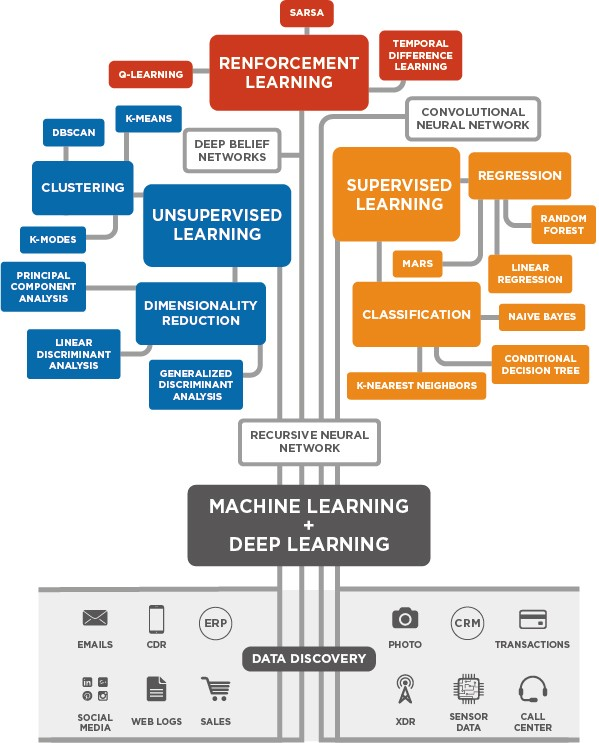

# Aprendizado de Máquina com Python
Adriano Sanick Padilha e José Carlos Bins Filho

# Métricas
## Métricas de Erro
### Metricas.ipynb
- MAE e RMSE - Qual métrica é melhor?

## 3 - Regressão Linear
### 31_RegressaoLinear.ipynb

- Apresenta um passo a passo para contrução de um modelo de regressão linear utilizando como exemplo o *Dataset* **"USA_Housing.csv"** extraído do site www.kaggle.com. Também é discutido as métricas de avaliação para este modelo.

### 32_ExercicioRegressaoLinear.ipynb
- O exercício proposto utiliza o *dataset* retirado do site www.kaggle.com. Este dataset é referente uma empresa de comércio eletrônico com sede na cidade de Nova York que vende roupas on-line.

### 33_SolucaoRegressaoLinear.ipynb
- Solução para o exercício proposto.
